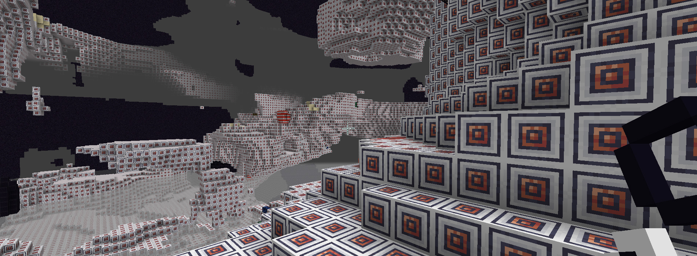

# Any Dimension Mod 2 Expansion - Applied Energistics 2

This mod adds dimensions for [Any Dimension Mod 2](https://github.com/luxmiyu/adm2)
using blocks from Applied Energistics 2.

- 
  [Get on Modrinth](https://modrinth.com/mod/adm2-ae2)
- 
  [Get on CurseForge](https://www.curseforge.com/minecraft/mc-mods/adm2-ae2)
- 
  [Get on Planet Minecraft](https://www.planetminecraft.com/mod/adm2-ae2)

### Developer Guide

If you'd like to create your own data pack or mod expansion for Any Dimension Mod 2, check out the GitHub page for
[Any Dimension Mod 2 Data Pack Expansion](https://github.com/luxmiyu/adm2-datapack).
This project serves as an example of what it would look like if you converted the data pack into an actual Fabric mod.